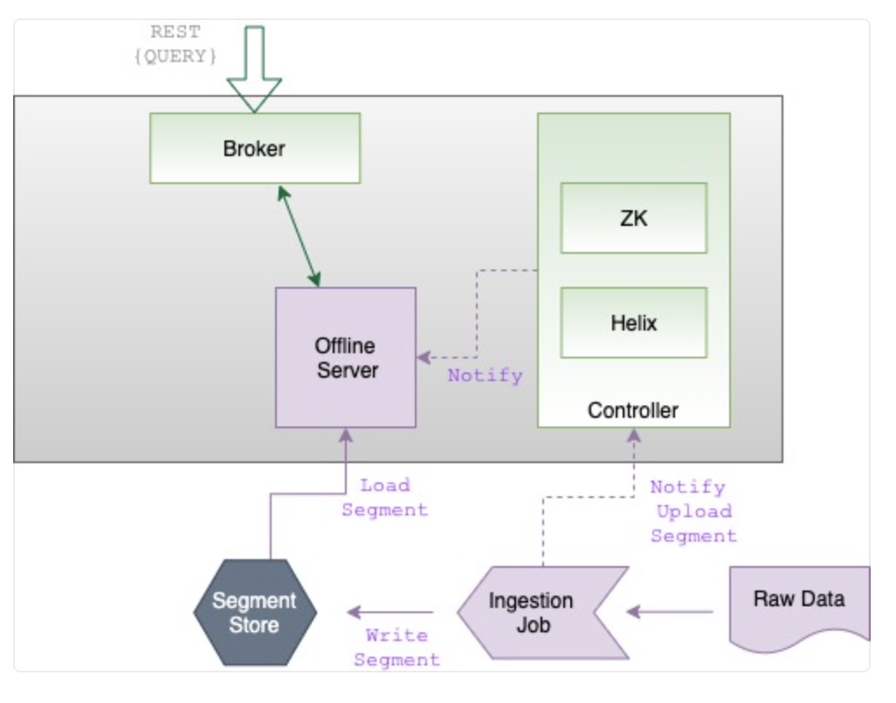
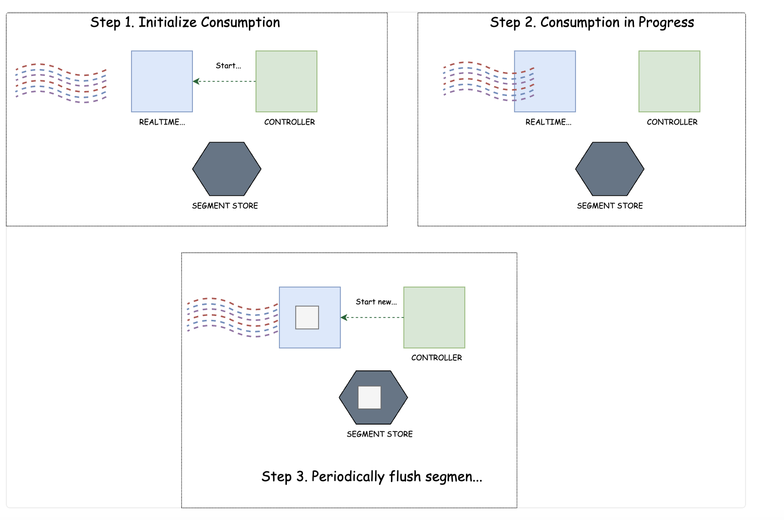

# Pinot POC

## Architecture
Pinot has a conventional distributed architecture, which includes components such as a controller, a broker and servers. Pinot implements the Apache Helix framework, a generic cluster management framework that provides an interface for distributed functionality.

The Controller manages and coordinates the distributed components within the cluster and uses the fault tolerant and highly consistent store Apache Zookeeper to manage configuration and metadata.

The Broker is a component that handles queries to the cluster and distributes them across available servers. If using a single-stage engine the broker's job includes retrieving the results in parallel and merging them to produce a final output. If using a multi-stage engine, after queries are processed in parallel a single server completes the next stage of processing and merges the final output to the broker. A RESTful HTTP interface is provided for Presto-compatible SQL integration. Our benchmark queries only work using a the multi-stage engine.

Servers provide storage on disk for segments, whilst also providing compute capabilities for query processing. As they are horizontally scalable, parallel querying and distributed replication are avaiable. 

Minions are an optional component to a cluster, designed to run background tasks that help with the movement of segments in and out of the cluster. In our POC, a Minion is tasked to move data from S3 into our Servers.

Similar to a namespace, Tenant is a component to the cluster that allows workloads on specifc tables to be run across specific hardware components within the cluster, using a labelling configuration. This is not necessary to set up since a default Tenant exists.

Pinot currently supports 3 distinct ways to create tables, with each one involving a different flow:

### Offline Tables: 

Offline tables are designed to ingest data in batches from sources such as CSV, Avro, JSON or Parquet files.

Typically an ingestion job would run in the background (using a Minion) and retrieve raw data files, transform into segments and store it either on the  Server's disk or in deep storage. The segment location is then updated on the broker's route table so it knows where to query it using the appropriate Server. 

Backfilling jobs are meant to be quick and easy with Offline Tables, however in order to do so the affected segments must be rewritten. Therefore doing upserts on particular records are not possible.

### Real Time Tables : 

Realtime tables ingest from streaming technologies such as Kafka or AWS Kinesis. They are designed specifically to scale the delivery of real-time data with low latency. 

While the cluster components remain the same as before, some of their roles become different. For instance, a Server will now act as a consumer to the Kafka broker, and store messages which in an in-memory segment called a consuming segment. Once a consuming segment is filled, a process runs to flush it to the segment store, which is either on disk or in deep storage.

This can be great for time critical use cases which requires data freshness in the matter of seconds. 

But there are a number of limitations with this approach compared to an offline table, such as:

- It is impossible to backfill past data
- It's also strictly limited to ingesting data from a streaming technology like Kafka, from a single broker
- There are no in-built rollup functions that would otherwise be available in offline tables

[Here's the full list of limitations with real-time tables](https://docs.google.com/document/d/1-e_9aHQB4HXS38ONtofdxNvMsGmAoYfSnc2LP88MbIc/edit)

## Approach: Offline Tables

For the POC we have decided to store data using Offline Tables, simply because we wanted to test performance on a timeseries dataset that would span 4 weeks with minute granurality. As well as having the overhead of managing a Kafka cluster, doing this via a real-time table would not be appropriate as it's not meant for batch ingesting a large amount of data in one go. If we were to do so, we might have had to scale many components such as the Kafka Cluster itself as well as the Servers within Pinot. 

To batch ingest into our Offline Tables, data was first uploaded to S3. A Minion job would then run and fetch the files and transform into segments and store into Servers. Using the Pinot's Controller API, we could see the progress of the jobs and debug. After issues pertaining to no storage were found in the Minion logs, components were given larger persistent storage.

## Comparison with Starrocks

The performance across the queries seems to be significantly faster on Pinot compared to Starrocks. In almost all cases, the first query takes longer than subsequent queries. As mentioned in the docs, this is because in the first query the segment is loaded into memory. Subsequent queries that require the same segment will not have to take this step, so it becomes substantially faster.

From an administration point of view, setting up is of a higher degree of complexity compared to Starrocks, which had a simpler architecture and was just made of two components. Pinot relies on many different components, some of which can be single points of failures. 

In terms of migration of workload, this would not be a simple lift and shift. Ingesting data into Pinot requires a batch ingestion job that cannot be done via SQL, but rather via file upload and scheduled  jobs running carried out by a Minion. Complex roll up tables, such as the one with peak concurrency, would have to be done in much the same way, as in-built roll-ups use basic aggregation functions on columns.
