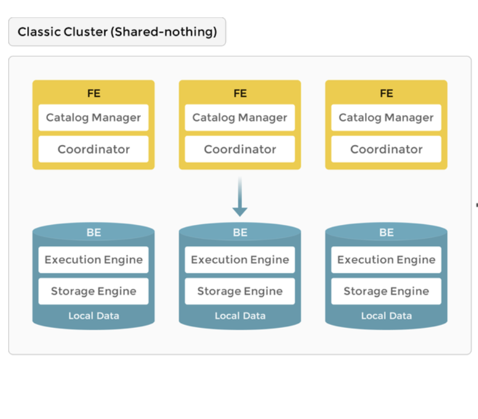
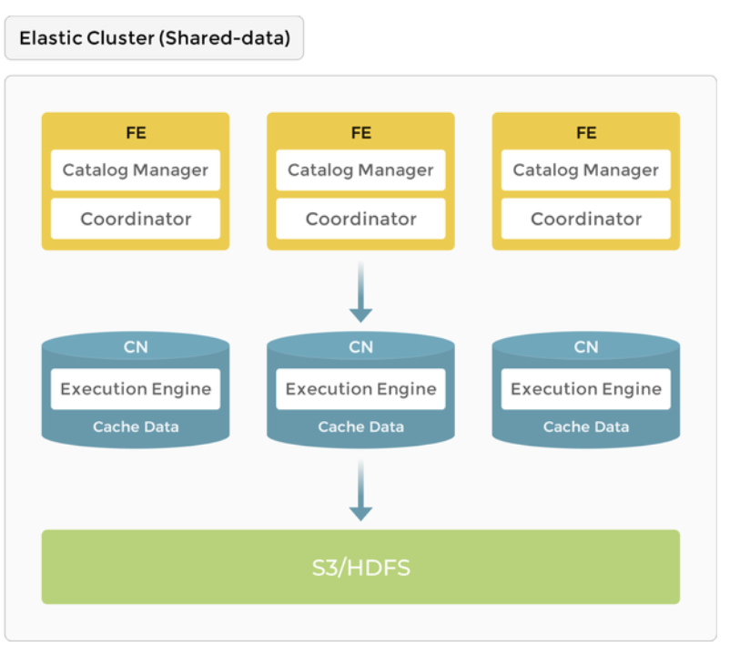

# Starrocks POC

## Architecture
There are two types of models you can deploy with Starrocks:

## Classic Cluster: 
In this architecture, the database is composed of Front End and Back End Nodes.

FE is responsible for metadata management, client connection management, query planning, and query scheduling.

BEs are responsible for both data storage and SQL execution. Each BE node will have a replica of the data stored on disk. 

The Front End also has the responsibility to distribute processes across the Backend nodes, enabling the database to become a Massive Parallel Processing (MPP) system. 

## Elastic Cluster : 

A newer alternative model has been released by Starrocks, where data is stored in a centrally located storage unit (S3, GCS etc.), helping reduce storage costs and allow for easy scalability.

## Approach: Classic Cluster

For the POC we have decided to deploy the Classic Cluster model, whereby data is not sourced from a shared data source (such as S3 or GCS), but rather stored in each BE node deployed. This will maximise performance as data will be stored on disk rather and avoid overhead of data network transmission between nodes and the storage location. 

The approach taken to deploy a POC for Starrocks is via a [K8s Operator](https://github.com/StarRocks/starrocks-kubernetes-operator).The operator is a custom K8's resource that manages the components of Starrocks. Installation of the K8's Operator can be done via helm charts. With this approach you can easily manage the lifecycle of StarRocks clusters, such as installing, scaling, upgrading etc.

As a first iteration approach we configured the helm chart to install 1 FE Node and 1 BE Node. 

The actual Node Group that our cluster is allocating resources to is a single c5n.4xlarge EC2 instance (16 cores and 52Gi RAM), which is costing approximately $10/day. The FE Node and BE Node is given a combined resource of 5vCPUs and 12Gi RAM to start with. This is a small amount compared to the size of our current Postgres
instances.

Our benchmark Postgres instance is costing $26/day, however this is hosted on CloudSQL, a fully managed service that also provides high availability, PITR, and support. Therefore a direct comparison of cost would be difficult until we get more information on pricing from Starrocks' managed provider CelerData.